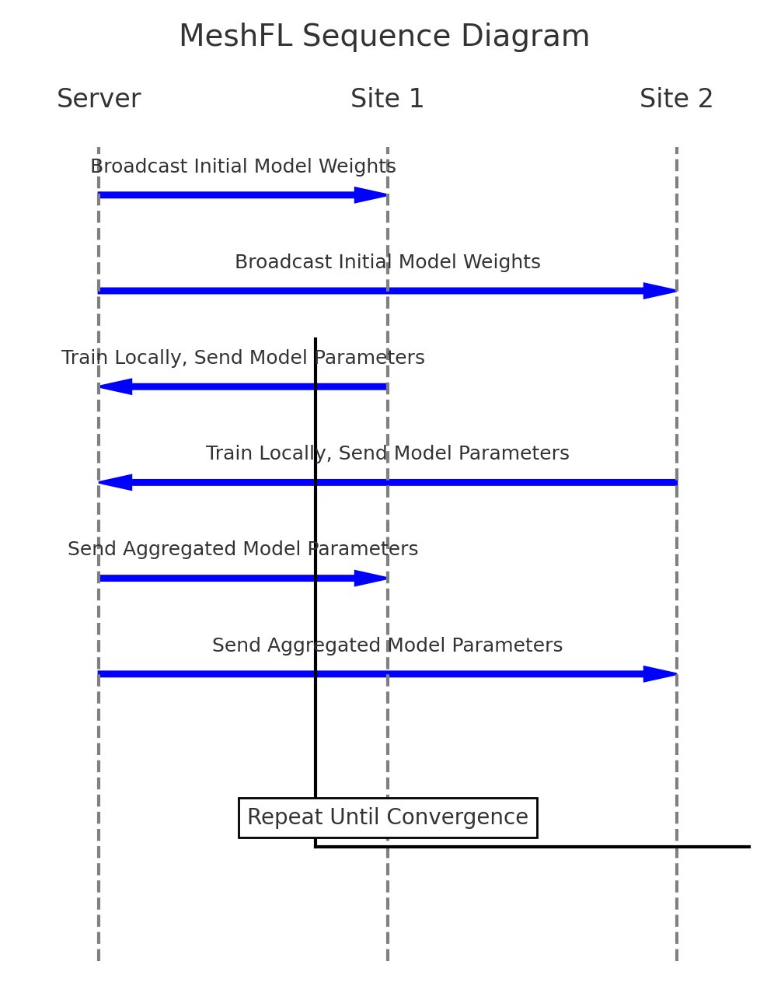
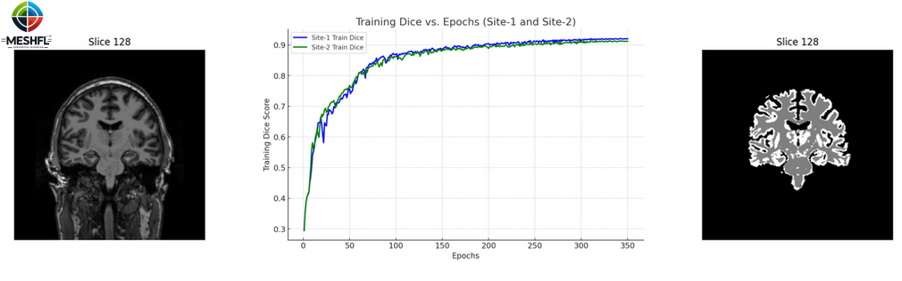

# Summary

Advances in federated learning paved the way for privacy-preserving collaborative training of machine learning models on decentralized datasets. This is particularly useful in neuroimaging, where sensitive data, such as brain MRI scans, cannot be easily shared across institutions. MeshFL is an open-source framework designed to facilitate distributed training of deep learning models for 3D brain MRI segmentation while maintaining data privacy. Built upon NVFlare [@nvflare], MeshFL employs federated learning principles to train MeshNet models [@Fedorov:2017] across multiple data sites, enabling high-accuracy segmentation of white and gray matter regions. With Dice scores of approximately 0.92 for training and  approximately  0.9 for validation, MeshFL demonstrates effective 3D brain MRI segmentation under the federated training configuration.

# Statement of Need

In neuroimaging, collaborative machine learning is often hindered by the sensitive nature of patient data and the computational demands of training large 3D models. Traditional centralized learning approaches require aggregating data in one location, which is impractical for datasets governed by strict privacy laws. Federated learning addresses this limitation by enabling model training without sharing raw data between sites [@mcmahan2017communication;  @rieke2020future].

The model choice is determined by the need to limit the bandwidth and reduce the risk of data leakage through the gradients shared during training. MeshNet is particularly suitable for this setting because of its compact architecture; in our current configuration, the model contains 5,688 trainable parameters with a raw parameter memory footprint of approximately 22.2 KiB.

Existing federated learning frameworks often lack specific adaptations for neuroimaging tasks. MeshFL fills this gap by offering:

- A tailored framework for 3D brain MRI segmentation using the MeshNet model.
- Integration with NVFlare for federated training workflows [@nvflare].
- Support for heterogeneously distributed data across sites.

MeshFL provides an easy-to-use yet robust environment for researchers and clinicians, ensuring high model performance while preserving patient privacy. 

# Implementation

MeshFL leverages NVFlare to implement federated learning workflows, allowing local sites to independently train the MeshNet model on their data and exchange model updates with a central server as shown in \autoref{fig:MeshFL-Seq-Diagram}. 

{ width=60% }

Key features of MeshFL include:

- **Data Preprocessing:** Automated partitioning of MRI scans into training, validation, and testing sets.

- **Model Training:** The framework utilizes PyTorch for implementing the MeshNet model and optimizing memory usage. Layer checkpointing further reduces memory overhead during training.

- **Aggregation Strategies:** MeshFL supports federated averaging of model weights, in which the global model is updated by averaging local weights contributed by each site. Initial model weights are shared across sites to provide consistent training initialization.

- **Custom Logger:** MeshFL includes a GenericLogger for detailed logging of training progress, gradient application, and Dice score evaluations.

- **Scalability:** Seamless support for multiple sites with varying data distributions and qualities.

The architecture of MeshNet, a 3D convolutional neural network, is optimized for volumetric brain MRI segmentation, employing dilated convolutions to capture contextual information while maintaining a compact parameter set [@Yu:2016]. A CrossEntropyLoss criterion with class weights addresses class imbalance in the dataset. 

MeshFL also integrates a learning rate scheduler to enhance training stability. Using OneCycleLR, the scheduler gradually increases the learning rate during the initial phase of training and decreases it afterward, ensuring convergence without disrupting the learning process. This approach prevents spikes in the learning rate and supports optimal parameter updates.

# Validation

The performance of MeshFL was validated using the Mindboggle dataset [@mindboggle] on 15 MRI samples labeled for white and gray matter segmentation. The federated simulation consisted of two sites, each using a local copy of the same 15-subject dataset. At each site, 11 subjects were used for training, 2 for validation, and 2 for testing, with the same split used across both sites. Training samples were shuffled within each local training loader, while the validation and test subsets remained fixed. Using the Dice coefficient as the evaluation metric and cross-entropy loss for training, MeshFL demonstrated effective segmentation performance under the federated training configuration.

Results demonstrated that MeshFL achieved Dice scores of approximately 0.92 for training and approximately 0.9 for validation, as shown in  \autoref{fig:MeshFL-Performance}. 

{ width=100% }

While MeshFL performs volumetric segmentation, slice 128 is shown for illustration, presenting the raw unsegmented slice on the left and the corresponding segmented output on the right, highlighting the segmentation quality achieved.

# Code Availability

MeshFL is openly available on GitHub at [https://github.com/Mmasoud1/MeshFL](https://github.com/Mmasoud1/MeshFL). The repository includes documentation, example scripts, and a wiki to guide users through installation and usage. Researchers can reproduce the experiments described here or adapt MeshFL for their applications.

# Author Contributions

We describe contributions to this paper using the CRediT taxonomy [@credit].
- **Writing – Original Draft:** M.M.
- **Writing – Review & Editing:** M.M., S.Panta., and S.Plis.
- **Conceptualization and Methodology:** M.M., P.R., and S.Plis.
- **Software and Data Curation:** M.M., and P.R.
- **Validation:** M.M., S.Plis., and S.Panta.
- **Project Administration:** M.M., and S.Panta.

# Acknowledgments

This work was funded by the NIH grant R01DA040487. Special thanks to Dylan Martin for his initial demonstration on using NVFlare.

# References
